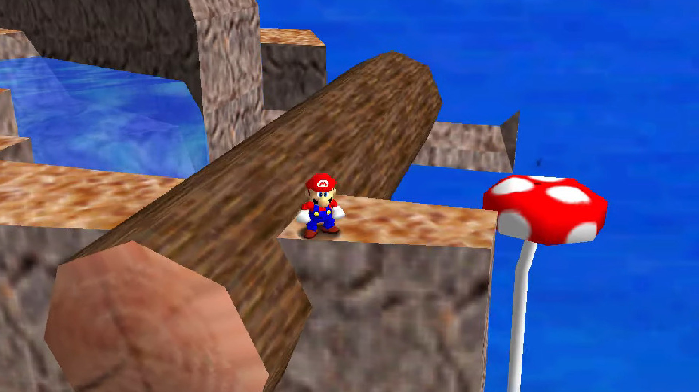
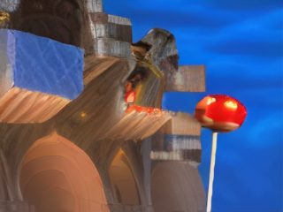
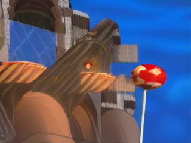
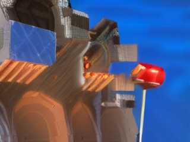
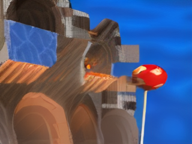
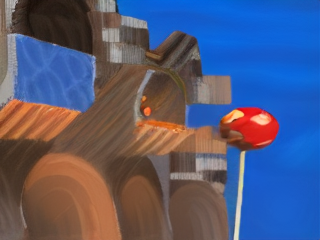

# N64 DLSS - Real-Time Neural Frame Enhancement for N64 Games

A naive approach to NVIDIA's DLSS concept applied to N64 emulation: capture frames from a libretro N64 core, pipe them through **StreamDiffusion + SD-Turbo** with **TensorRT** acceleration, and display the enhanced result in real time — all on a single consumer GPU.

This is an experiment in real-time diffusion-based frame enhancement. It runs at **39 FPS on a GTX 4060** at N64's native 320x240 resolution with TensorRT, well above the 24 FPS playability threshold.

## Example Outputs

All examples below are from Super Mario 64 (320x240), processed in a single diffusion step.

| Original | Enhanced (t=35) |
|----------|----------------|
|  |  |

| Ghibli Style | Synthwave |
|-------------|-----------|
|  |  |

| Watercolor | Oil Painting |
|-----------|-------------|
|  |  |

## Architecture

```
┌─────────────┐     ┌──────────────┐     ┌─────────────────────┐
│  N64 Core   │────>│  Frame       │────>│  StreamDiffusion     │
│  (libretro) │     │  Capture     │     │  + SD-Turbo + TRT    │
│             │     │  (callback)  │     │  (background thread) │
└─────────────┘     └──────────────┘     └──────────┬────────────┘
       │                                            │
       │            ┌──────────────┐                │
       └───────────>│  OpenGL      │<───────────────┘
                    │  Display     │   enhanced frame swap
                    │  (pygame)    │
                    └──────────────┘
                           │
                    ┌──────────────┐
                    │  tkinter     │
                    │  Control     │
                    │  Panel       │
                    └──────────────┘
```

- **N64 Core**: `parallel_n64_libretro.dll` loaded via ctypes, running the angrylion software renderer
- **Frame Capture**: libretro `video_refresh` callback grabs each frame as a numpy array
- **Diffusion**: StreamDiffusion wraps SD-Turbo in a pipelined img2img loop with TensorRT engines
- **Display**: pygame + OpenGL renders the (optionally enhanced) frame as a textured quad
- **Control Panel**: tkinter window with prompt editing, t_index/delta sliders, and style presets

## Performance

Benchmarked on **NVIDIA GTX 4060 (8GB VRAM)** at 320x240:

| Configuration | FPS | Latency | VRAM |
|--------------|-----|---------|------|
| No acceleration (Python 3.13) | 24.0 | 41.7ms | 2.4 GB |
| **TensorRT (Python 3.10)** | **39.0** | **25.7ms** | **2.43 GB** |

5.5 GB VRAM headroom remaining for future ControlNet integration.

## Setup

### Prerequisites

- Windows 10/11 with NVIDIA GPU (tested on GTX 4060)
- **Python 3.10** (required for TensorRT compatibility)
- CUDA 11.8 + cuDNN
- Git

### 1. Clone this repo

```bash
git clone https://github.com/YOUR_USERNAME/n64-dlss.git
cd n64-dlss
```

### 2. Set up StreamDiffusion

```bash
git clone https://github.com/cumulo-autumn/StreamDiffusion.git
cd StreamDiffusion
pip install -e .
pip install -e ".[tensorrt]"
cd ..
```

#### Required patches to StreamDiffusion

These patches are needed to support N64's 240p resolution and fix compatibility issues:

**`StreamDiffusion/src/streamdiffusion/acceleration/tensorrt/models.py`** — Change `min_image_shape` from 256 to 192:
```python
# Line with min_image_shape = 256 // 8
min_image_shape = 192 // 8  # Support 240p
```

**`StreamDiffusion/src/streamdiffusion/acceleration/tensorrt/builder.py`** — Change `min_image_resolution` default:
```python
min_image_resolution: int = 192,  # was 256
```

**`StreamDiffusion/src/streamdiffusion/acceleration/tensorrt/utilities.py`** — Remove `hf_token` from model instantiations in `create_models()`:
```python
# Remove hf_token=use_auth_token from CLIP, UNet, VAE, VAEEncoder constructors
```

### 3. Create Python 3.10 virtual environment

```bash
python -m venv venv310
source venv310/Scripts/activate  # Windows
# or: source venv310/bin/activate  # Linux/Mac

pip install torch==2.1.0 --index-url https://download.pytorch.org/whl/cu118
pip install xformers==0.0.22.post7 --index-url https://download.pytorch.org/whl/cu118
pip install numpy==1.26.4
pip install diffusers==0.24.0 transformers==4.36.2 huggingface_hub==0.23.5
pip install pygame PyOpenGL PyOpenGL_accelerate Pillow
```

### 4. Get a libretro N64 core

Download `parallel_n64_libretro.dll` (Windows) from the [libretro buildbot](https://buildbot.libretro.com/nightly/windows/x86_64/latest/) and place it in:

```
n64Emulator/cores/parallel_n64_libretro.dll
```

### 5. Provide a ROM

Place your N64 ROM (`.z64` format) at:

```
n64Emulator/sm65.z64
```

Or modify the path in `n64_dlss_live.py`.

### 6. Run

```bash
source venv310/Scripts/activate
python n64_dlss_live.py
```

The first run will build TensorRT engines (~6.5 minutes), which are cached in `engines/` for subsequent runs.

## Controls

### Game Controls
| Key | Action |
|-----|--------|
| Arrow Keys | D-Pad |
| WASD | Analog Stick |
| X / Z | A / B Buttons |
| Left Shift | Z Trigger |
| Q / E | L / R Shoulder |
| Enter | Start |
| I / J / K / L | C-Buttons |

### Application Controls
| Key | Action |
|-----|--------|
| F2 | Toggle diffusion on/off |
| F1 | Reset emulator |
| ESC | Quit |

## How It Works

### The Naive Approach

This project uses **SD-Turbo** (a single-step distilled Stable Diffusion model) in img2img mode via **StreamDiffusion** (a pipeline-optimized real-time wrapper). Each N64 frame is:

1. Captured from the libretro core's video callback
2. Preprocessed into a latent tensor
3. Denoised by the UNet (single TensorRT-accelerated step)
4. Decoded by a tiny VAE back to pixels
5. Displayed via OpenGL

The key parameter is **t_index** — the denoising timestep where the process starts:
- **Low t_index (0-30)**: Heavy restyling, loses scene structure
- **High t_index (40-49)**: Faithful to original, minimal effect
- **Sweet spot (~35)**: Mild enhancement while preserving the scene

### Limitations

Without structural conditioning (ControlNet/T2I-Adapter), there's a fundamental tradeoff between style intensity and scene preservation. The model can either faithfully reproduce the scene OR apply a strong style, but not both simultaneously. See `scratchpad.md` for plans to address this with ControlNet + depth buffer extraction from the emulator.

## Style Presets

The control panel includes 6 built-in presets:

| Preset | Prompt | t_index |
|--------|--------|---------|
| Default Enhance | high quality, enhanced, sharp, detailed, remastered | 35 |
| Studio Ghibli | studio ghibli style, anime background, lush detailed | 32 |
| Watercolor | watercolor painting, soft edges, flowing colors, artistic | 33 |
| Oil Painting | oil painting, thick brushstrokes, impressionist, painterly | 33 |
| Synthwave | neon synthwave, glowing edges, cyberpunk, purple blue | 30 |
| Modern Game | modern AAA video game, ray traced, photorealistic, UE5 | 35 |

## Project Structure

```
n64-dlss/
├── n64_dlss_live.py          # Main integration script
├── n64Emulator/
│   ├── n64_frontend.py       # Libretro frontend (ctypes + pygame + OpenGL)
│   └── cores/                # Place libretro core DLLs here
├── examples/                 # Example output images
├── benchmark_streamdiffusion.py
├── benchmark_optimized.py
├── benchmark_tensorrt.py
├── benchmark_results.json
├── test_cartoon.py           # Style transfer experiments
├── scratchpad.md             # ControlNet integration plans
├── research_summary.md       # Model research notes
├── research_real_time_frame_generation.md
└── research_report.html      # Full research report
```

## Future Work

- **ControlNet / T2I-Adapter integration** — Use the emulator's depth buffer (z-buffer) as structural conditioning to enable strong style transfer while preserving scene layout. See `scratchpad.md` for detailed plans.
- **RIFE frame interpolation** — Insert interpolated frames between diffusion outputs to reach 60+ FPS effective framerate
- **INT8 quantization** — Further TensorRT optimization
- **Audio passthrough** — Currently audio is silenced

## References

- [StreamDiffusion](https://github.com/cumulo-autumn/StreamDiffusion) — Real-time diffusion pipeline
- [SD-Turbo](https://huggingface.co/stabilityai/sd-turbo) — Single-step distilled Stable Diffusion
- [libretro API](https://docs.libretro.com/) — Emulator core interface
- [parallel_n64](https://github.com/libretro/parallel-n64) — N64 libretro core

## License

MIT
